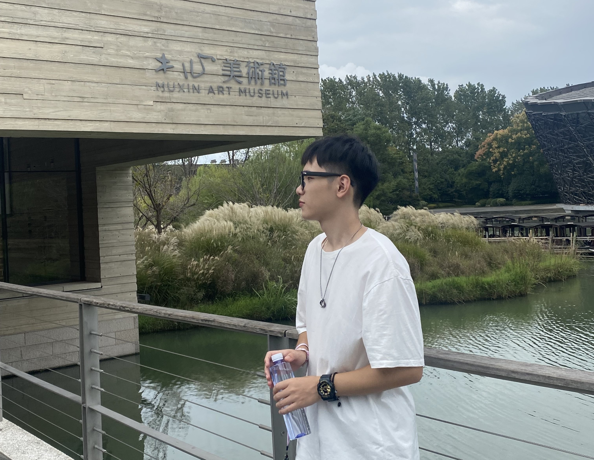

In addition to academic research, I am passionate about photography and cooking. 

Photography allows me to observe the world through the lens, capturing natural landscapes and human emotions, while cooking is one of my ways to release stress and cultivate creativity. 

These hobbies not only provide me with balance and enjoyment but also influence and enrich my academic work, injecting new inspiration and perspectives.